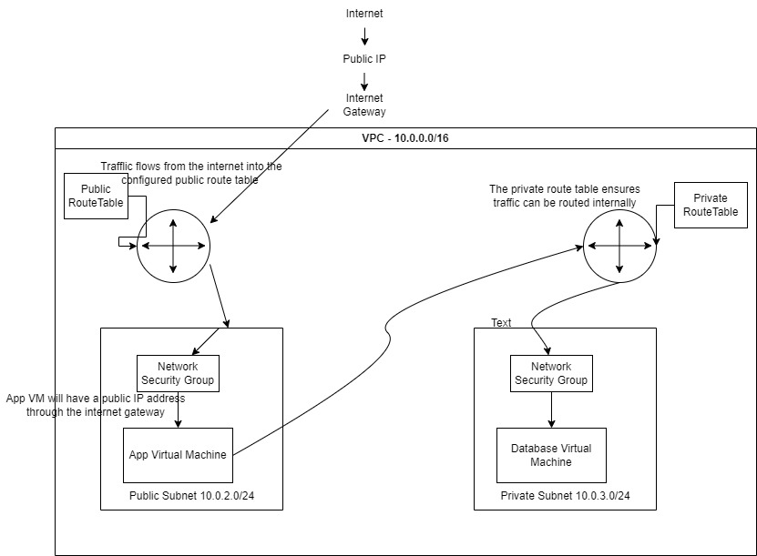

#### Sign in to the AWS Management Console: 
Navigate to the VPC Dashboard.

#### Create a VPC:
Click on "Your VPCs" and then "Create VPC".
Provide a name for the VPC.
Specify a CIDR block for the VPC, e.g., 10.0.0.0/16.
Click "Create".


#### Create Subnets:
Public Subnet:
Click on "Subnets" and then "Create subnet".
Provide a name, e.g., "PublicSubnet".
Select the VPC you created.
Specify a CIDR block, e.g., 10.0.2.0/24.
Choose an Availability Zone.
Click "Create".
Private Subnet:
Repeat the above steps but name it "PrivateSubnet" and use a different CIDR block, e.g., 10.0.3.0/24.


#### Create an Internet Gateway:
Click on "Internet Gateways" and then "Create internet gateway".
Provide a name and click "Create".
Attach the created Internet Gateway to your VPC.


#### Configure Route Tables:
Public Route Table:
Click on "Route Tables" and then "Create route table".
Provide a name, e.g., "PublicRouteTable".
Select your VPC and click "Create".
Select the created route table and go to the "Routes" tab.
Click "Edit routes" and add a route to allow traffic to the internet: Destination 0.0.0.0/0 and target as the Internet Gateway you created.
Associate this route table with the "PublicSubnet".
Private Route Table:
AWS automatically creates a route table for every VPC. You can use this as your private route table.
Associate this route table with the "PrivateSubnet".


#### Launch VMs (EC2 Instances):
Public VM:
Go to the EC2 Dashboard and click "Launch Instance".
Choose an AMI (Amazon Machine Image).
Select an instance type.
In the "Configure Instance" step, select your VPC and "PublicSubnet".
Ensure "Auto-assign Public IP" is set to "Enable".
Complete the remaining steps (add storage, tags) and launch the instance after selecting or creating a key pair.
Private VM:
Repeat the above steps but select "PrivateSubnet" in the "Configure Instance" step.
Ensure "Auto-assign Public IP" is set to "Disable".


#### Security Groups:
For added security, create security groups to define inbound and outbound traffic rules for your VMs. For instance:
A security group for the public VM to allow inbound SSH traffic.
A security group for the private VM to restrict inbound traffic only from the public subnet.


#### Test Connectivity:
SSH into the public (app) VM using its public IP.
Due to the reverse proxy we should see the posts page with text from the database 


## What are Virtual Private Clouds (VPCs)?

**VPC stands for Virtual Private Cloud.** 

A VPC is a virtual network dedicated to your AWS account. It enables you to launch AWS resources into a virtual network that you've defined. 

When you create a VPC, you specify its private IPv4 address range (in the form of a CIDR block, such as 10.0.0.0/16), create subnets, configure route tables, and configure security settings.

#### Diagram displaying VPCs


## Setting up Virtual Private Clouds (VPCs) in AWS

### Step 1: Sign into AWS Concole

- Go to the AWS Management Console. <br>
- Sign in with your AWS account credentials.

### Step 2: Creating a VPC

1. Search for VPC on your AWS console, Navigate to `Your VPCs`

2. Then press `create VPC`

3. Fill in the details to `Create VPC`
- Select `VPC only`
- Create an identifiable name tage e.g `tech254-chiedozie-2tier-first-vpc`
- IPv4 CIDR block - keep as default 
- Input IPv4 CIDR `10.0.0.0/16`

4. Tags: these are pre-filled, then press `create`

5. You have now successfully created a VPC


### What are Subnets?

Subnets are subdivisions of your VPC's IP address range, and resources are launched inside these subnets. 

Subnets help in organizing resources, improve security by providing segmentation, and allow for high availability by placing resources in different availability zones. Subnets are contained within a VPC and cannot exist outside of it.

### Step 3: Creating Subnets

1. Navigate to `Subnets`

2. Select the VPC that you have created 

3. Within the VPC we much create 2 subnets. A public subnet and a private subnet.

Fill in the details of your public subnet 
- `Subnet name`
- `Availibility Zone`
- Enter IPv4 VPC CIDR block `10.0.2.0./24`
- Tags - these are pre-filled

4. Fill in the details of your private subnet 
- `Subnet name`
- `Availibility Zone`
- Enter IPv4 VPC CIDR block `10.0.3.0./24`
- Tags - these are pre-filled

5. Then press `Create subnet`


6. You have now successfully created 2 subnets within your VPC. 


### Step 4: Creating an Internet Gateway

1. Navigate to`Internet Gateway`
2. Select `Create Internet Gateway`
3. Create a Name tag e.g. `tech254-chiedozie-2tier-vpc-ig`

4. Then select `Create internet gateway `

5. Your internet gateway has now been created, now **we must attach it to the VPC**.

- Click *Actions* > `Attach a VPC`

6. Search for your VPC and select `Attach to Internet Gateway`

### Step 5: Creating a Route table

1. Navigate to Route Tables

2. Create Route Tables
- Create a Name e.g `public-rt`
- Then select your VPC from the dropdown
3. Then select `Create Route Table`

You have now successfully created route table.

### Step 6: Creating Association

5. Navigate to `Subnet Association`

6. Click `Edit Subnet Association`

7. Check the `puclic-subnet` option

### Connecting your internet gateway to your route table
- `Edit Routes`
- `Add Route`
- `Enter destination: 0.0.0.0./0`
- `Target:` select you internet gateway
- Select `create`

8. You can now test your pathway by navigating to your resource map in Internet gateway.

### Step 7: Creating your Virtual Machines

#### Creating your Database Instance

1. Navigate to AMIs in EC2. 
2. Search for your AMI and select this
5. Then select `Launch Instance from AMI`

Launching your instance

1. Name = `tech254-chiedozie-db-vpc`
5. Key pair = tech254
6. Network settings > Edit settings 
7. VPC > select your VPC
8. Subnet: Select `private-subnet`
9. Select `disable`

10. Create security Group
11. Fill in MongoDB security using the following:
12. Then review the configurations and select `Launch Instance`

#### Creating your App Instance

1. Navigate to AMIs in EC2. 
2. Search for your AMI that contains the app. 
5. Then select `Launch Instance from AMI`

#### Launching your instance

1. Name = `tech254-chiedozie-app--vpc`
5. Key pair = tech254
6. Network settings > Edit settings 
7. VPC > select your VPC
8. Subnet: Select `public-subnet`
9. Select `enable`
10. Create security Group
11. Create Security Rules as the following:
12. Then navigate to `User Data`
- Then enter the following commands 

```
#!/bin/bash

export DB_HOST=mongodb://private_IP_of_DB_instance:27017/posts

cd /home/ubuntu/repo/app
sudo systemctl restart nginx
npm install
node seeds/seed.js
sudo npm install pm2 -g

pm2 kill
pm2 start app.js
```

3. Select `Launch Instance`
4. Navigate to you app instance and copy and paste the public IP address. This should load the app page.
5. In the url after the IP address enter `/posts`
- This should navigate you to the data page