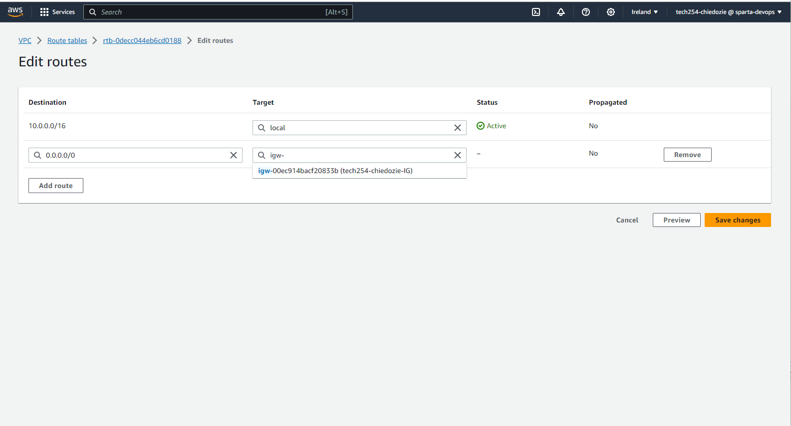
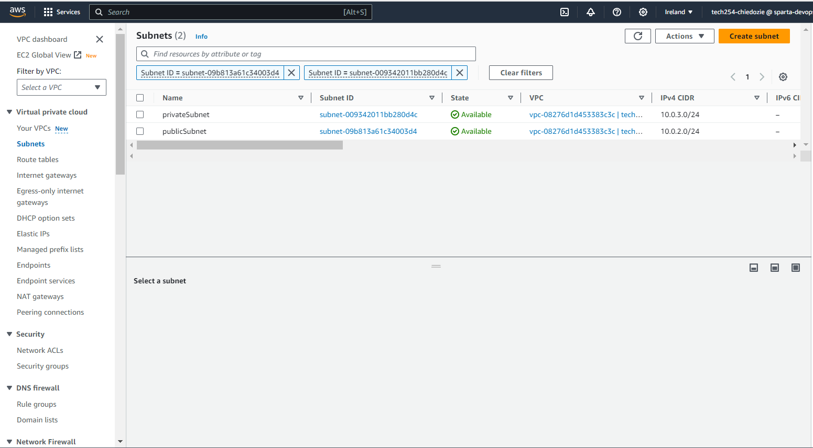
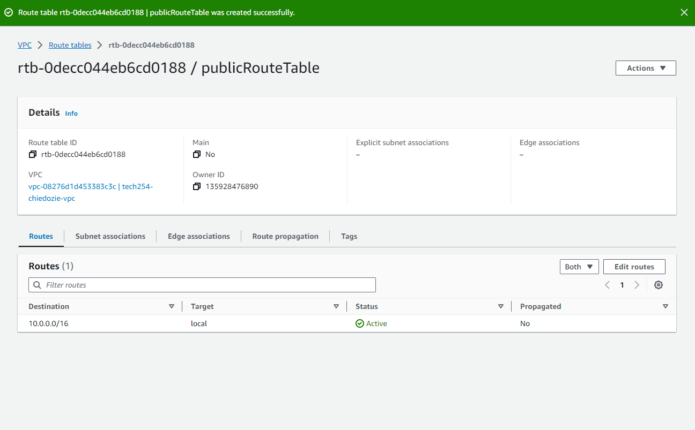
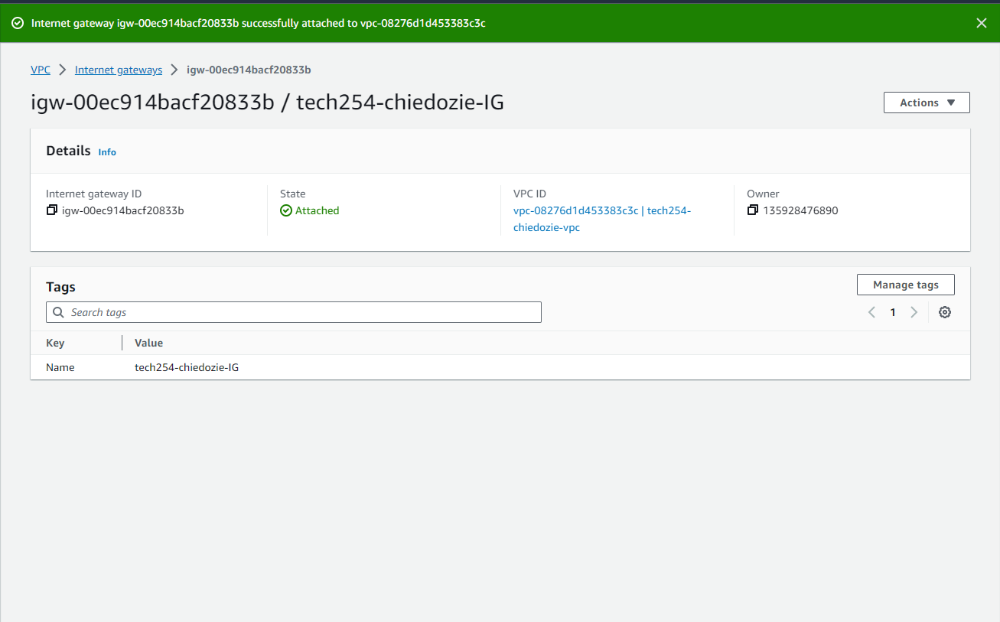
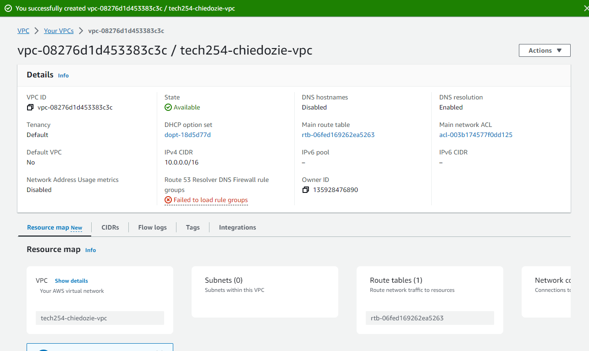

#### Sign in to the AWS Management Console: 
Navigate to the VPC Dashboard.

#### Create a VPC:
Click on "Your VPCs" and then "Create VPC".
Provide a name for the VPC.
Specify a CIDR block for the VPC, e.g., 10.0.0.0/16.
Click "Create".
#### Create Subnets:
Public Subnet:
Click on "Subnets" and then "Create subnet".
Provide a name, e.g., "PublicSubnet".
Select the VPC you created.
Specify a CIDR block, e.g., 10.0.2.0/24.
Choose an Availability Zone.
Click "Create".
Private Subnet:
Repeat the above steps but name it "PrivateSubnet" and use a different CIDR block, e.g., 10.0.3.0/24.
#### Create an Internet Gateway:
Click on "Internet Gateways" and then "Create internet gateway".
Provide a name and click "Create".
Attach the created Internet Gateway to your VPC.
#### Configure Route Tables:
Public Route Table:
Click on "Route Tables" and then "Create route table".
Provide a name, e.g., "PublicRouteTable".
Select your VPC and click "Create".
Select the created route table and go to the "Routes" tab.
Click "Edit routes" and add a route to allow traffic to the internet: Destination 0.0.0.0/0 and target as the Internet Gateway you created.
Associate this route table with the "PublicSubnet".
Private Route Table:
AWS automatically creates a route table for every VPC. You can use this as your private route table.
Associate this route table with the "PrivateSubnet".
#### Launch VMs (EC2 Instances):
Public VM:
Go to the EC2 Dashboard and click "Launch Instance".
Choose an AMI (Amazon Machine Image).
Select an instance type.
In the "Configure Instance" step, select your VPC and "PublicSubnet".
Ensure "Auto-assign Public IP" is set to "Enable".
Complete the remaining steps (add storage, tags) and launch the instance after selecting or creating a key pair.
Private VM:
Repeat the above steps but select "PrivateSubnet" in the "Configure Instance" step.
Ensure "Auto-assign Public IP" is set to "Disable".
#### Security Groups:
For added security, create security groups to define inbound and outbound traffic rules for your VMs. For instance:
A security group for the public VM to allow inbound SSH traffic.
A security group for the private VM to restrict inbound traffic only from the public subnet.
#### Test Connectivity:
SSH into the public VM using its public IP.
From the public VM, try SSHing into the private VM using its private IP to ensure connectivity.

