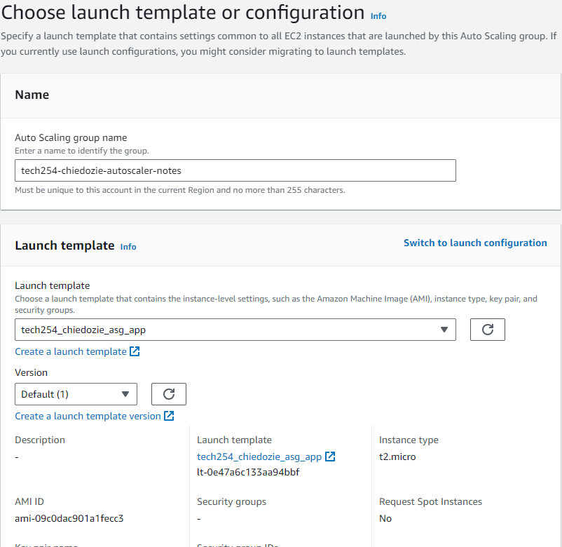
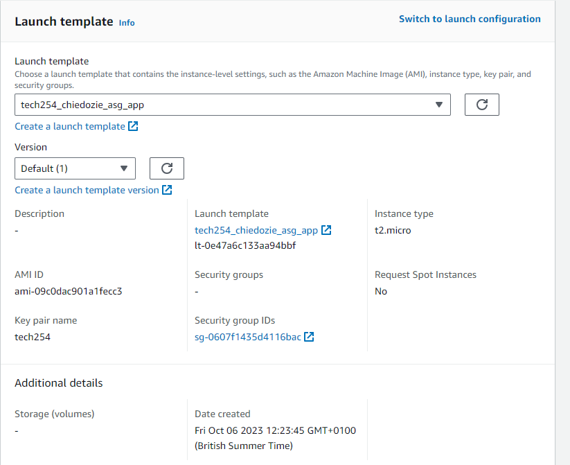
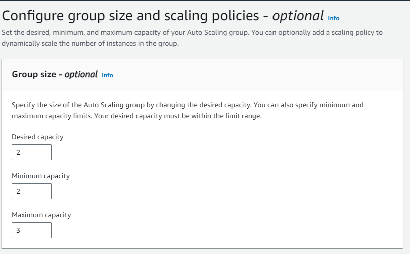
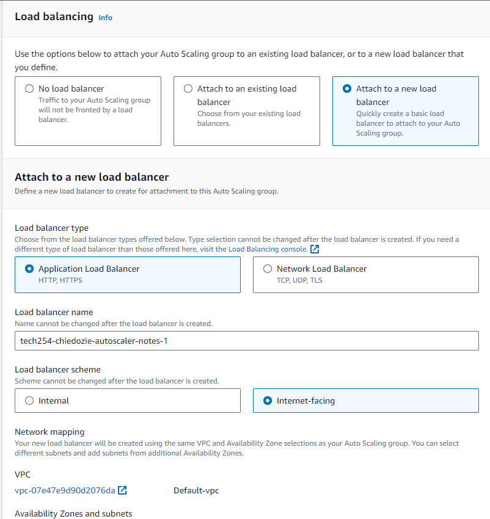
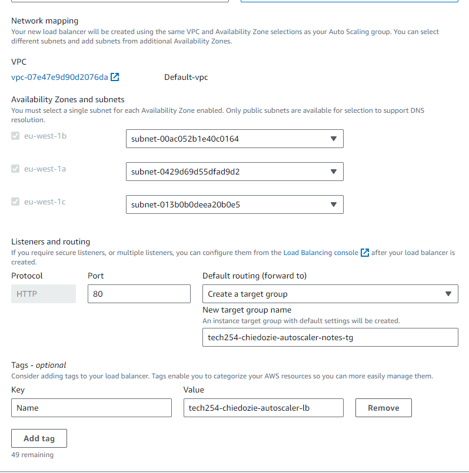
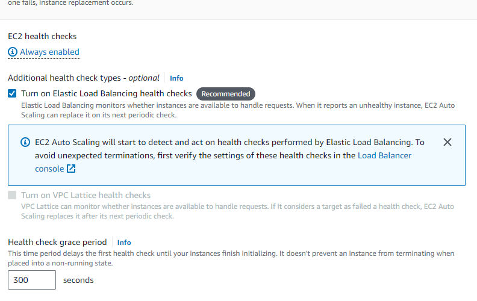
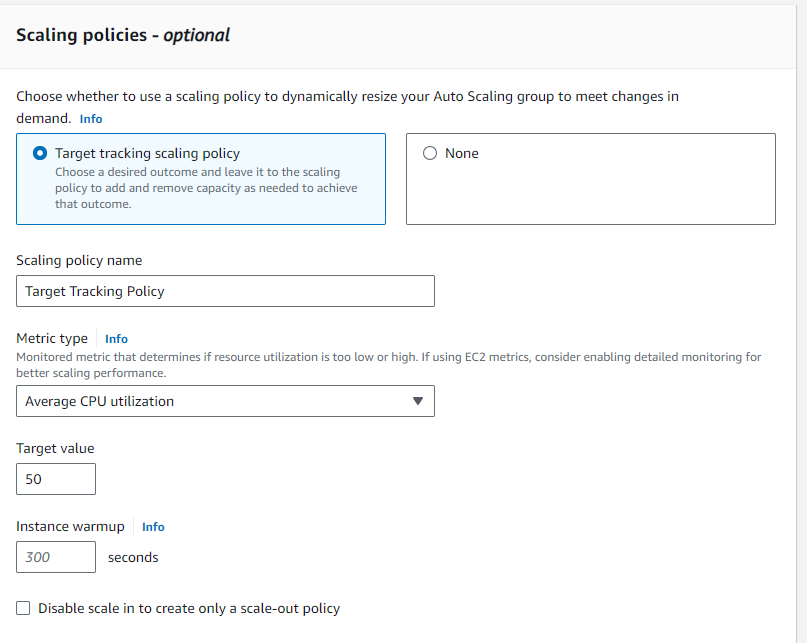
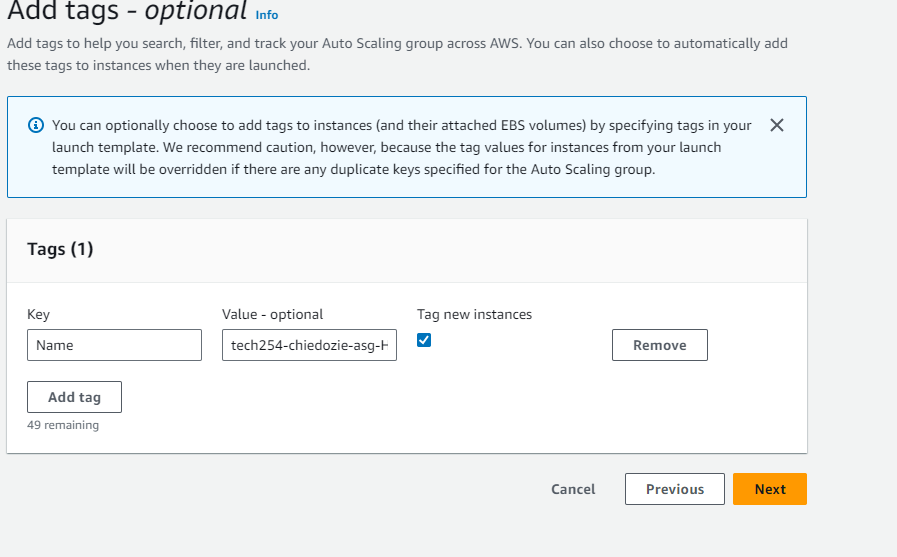

# _Setting Up Auto Scaling on AWS_

#### Initiate Auto Scaling Group Creation:
- Log into AWS and select EC2, on the left navigation pane, under 'AUTO SCALING', click on 'Auto Scaling Groups'. 

- Click the 'Create Auto Scaling group' button. 

 

 

- Optionally you can create a launch configuration. This defines the EC2 instance settings. 

#### Set Up Launch Template:

- Select an AMI (Amazon Machine Image). 

- Choose the desired EC2 instance type. 

- Configure additional settings (e.g. key pair, security groups). 

- Click 'Next' and adjust advanced settings such as user data to set up scripts if necessary, and finalize by clicking 'Create launch template'. 

#### Define Auto Scaling Group Parameters:

- Name the Auto Scaling Group. 

- Specify the initial group size (number of EC2 instances to start with). 

- Select the VPC (Virtual Private Cloud) and subnets for your instances. 

- If you have a load balancer, integrate it after this by selecting "Attach to an existing Load Balancer". 

#### Set Up a Load Balancer:

   - If you don't have a load balancer you can create one by selecting "Attach to a New Load Balancer" to the EC2 dashboard. 

   - Choose the type of load balancer you want (e.g., Application Load Balancer) and click "Create". 

   - Follow the wizard to configure the load balancer settings, listeners, target groups and tags e.g. Name 

  

  

  

#### Determine Scaling Policies:

- Use scaling policies to adjust the capacity of the group. 

- Define the conditions to scale out (add instances) or scale in (remove instances). For instance, you can set rules based on CPU utilization thresholds. 

 

#### Set Up Notifications (Optional):

- Configure notifications to receive alerts when instances are launched or terminated. 

#### Tag Your Instances:

- Assign tags to your instances for easier identification later on. 

#### Accessing, Reviewing, Monitoring and Fine-Tuning:

- Go over all configurations to ensure accuracy. 

- Return to the EC2 dashboard to observe the instances being launched or terminated based on your scaling policies. 

- Regularly review your scaling policies and adjust as needed to optimize performance and costs. 

- Use the DNS Server (Domain Name System) to access machine from load balancer.  

- For Cleanup, be sure to delete load balancer first and then the other artefacts.