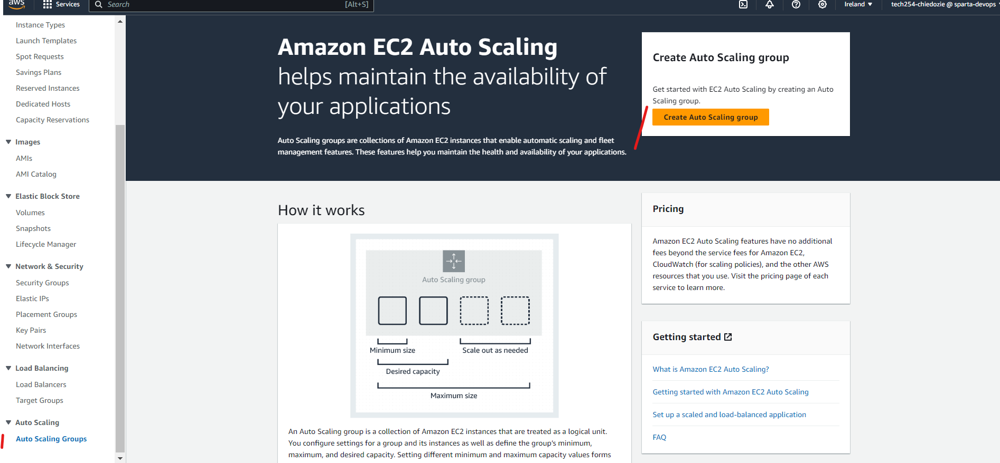

# Setting Up Auto Scaling on AWS

#### Initiate Auto Scaling Group Creation:
- Log into AWS and select EC2, on the left navigation pane, under 'AUTO SCALING', click on 'Auto Scaling Groups'.

- Click the 'Create Auto Scaling group' button.
- If prompted, create a launch configuration. This defines the EC2 instance settings.
#### Set Up Launch Template:
•	Select an AMI (Amazon Machine Image).
•	Choose the desired EC2 instance type.
•	Configure additional settings (e.g. key pair, security groups).
•	Click 'Next' and adjust advanced settings such as user data to set up scripts if necessary, and finalize by clicking 'Create launch template'.
#### Define Auto Scaling Group Parameters:
•	Name your group.
•	Specify the initial group size (number of EC2 instances to start with).
•	Select the VPC (Virtual Private Cloud) and subnets for your instances.
•	If you have a load balancer, integrate it at this stage.
#### Set Up a Load Balancer**:
   - Navigate to the EC2 dashboard.
   - In the navigation pane, under "Load Balancing", click "Load Balancers".
   - Click "Create Load Balancer".
   - Choose the type of load balancer you want (e.g., Application Load Balancer) and click "Create".
   - Follow the wizard to configure the load balancer settings, listeners, and target groups.
#### Determine Scaling Policies:
•	Opt for 'Use scaling policies to adjust the capacity of this group'.
•	Define the conditions to scale out (add instances) or scale in (remove instances). For instance, you can set rules based on CPU utilization thresholds.
#### Set Up Notifications (Optional):
•	Configure notifications to receive alerts when instances are launched or terminated.
#### Tag Your Instances:
•	Assign tags to your instances for easier identification later on.
#### Review and Activate:
•	Go over all your configurations to ensure accuracy.
•	Click 'Create Auto Scaling group'.
1.	Monitor Your Instances:
•	Return to the EC2 dashboard to observe the instances being launched or terminated based on your scaling policies.
1.	Fine-Tuning:
•	Regularly review your scaling policies and adjust as needed to optimize performance and costs.
use dns to access machine from load balancer

For Cleanup
delete load balancer first