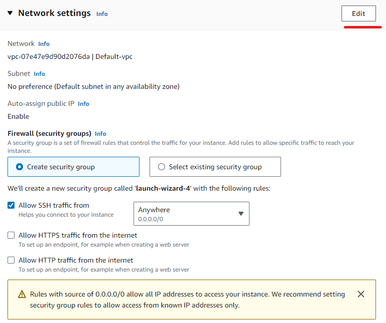
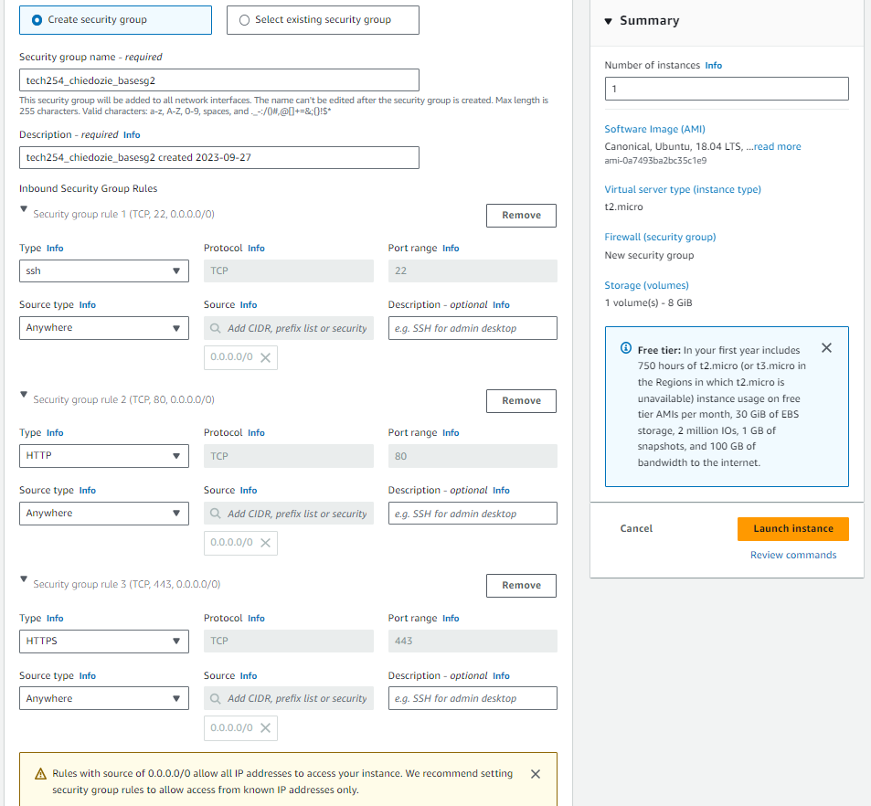
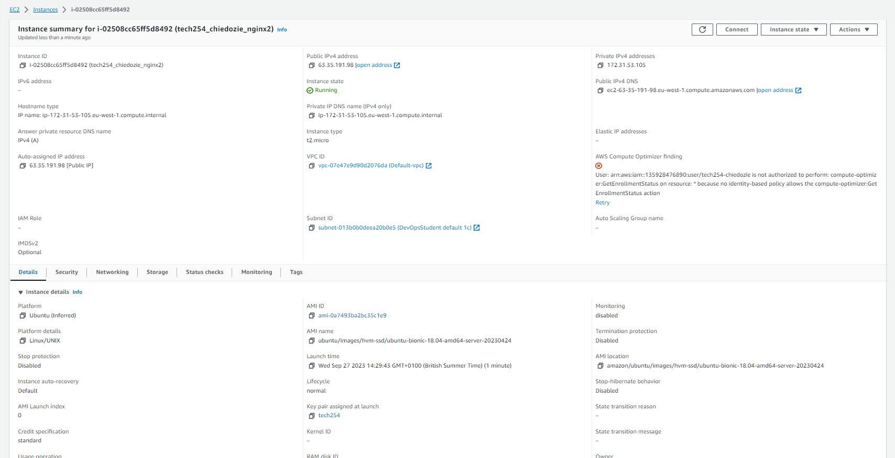
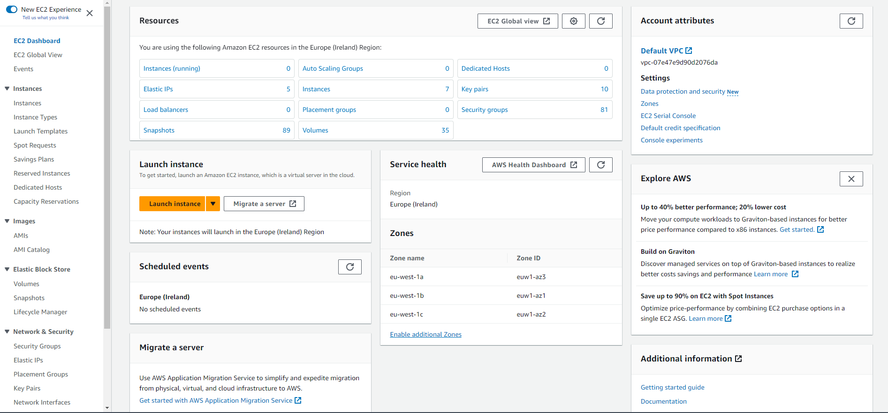
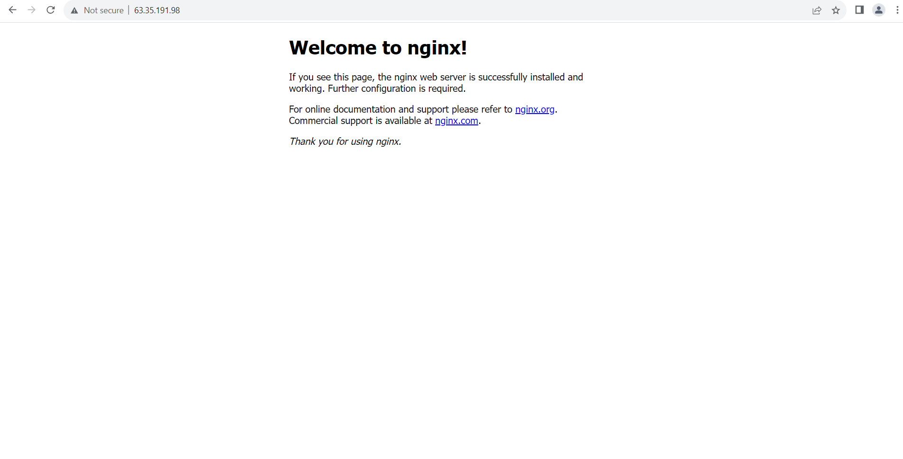

# Go to AWS Select EC2 as this is the machine we are going to set up - remember to be in **Ireland**
# On EC2 page select orange launch instance button 
# On the menu name the instance using an appropriate naming convention e.g. stream_name_purpose
# Select an appropriate machine image - this is the OS your machine will run on
# Select and appropriate instance type
# Select an appropriate key pair login for secure connection
# Edit network settings to determine security group


# Configure storage if needed
# Check summary to confirm settings are as required


# To connect to your machine open a git bash terminal and enter the .ssh folder, this is where your key is stored from earlier ``` cd ~/.ssh```
# Once there Run this command, if necessary, to ensure your key is not publicly viewable. ```chmod 400 tech254.pem```
# Then copy the code provided on AWS: ``` ssh -i "tech254.pem" ubuntu@ec2-63-35-191-98.eu-west-1.compute.amazonaws.com```
# Once connected you will need to get your machine updated, install and then start nginx you can do this by the following commands
# 
``` 
sudo apt update
sudo apt upgrade
sudo apt install nginx y
sudo systemctl start nginx
```

# Then you can access by simply typing in your public ip into any browser
