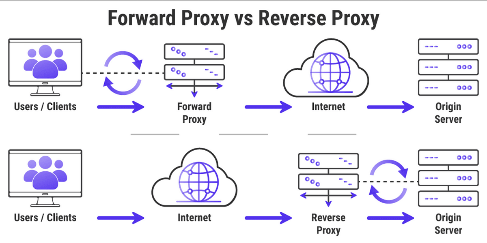

# Reverse Nginx Proxy

### What are ports?

- Endpoint identifiers in the transport layer of the Internet Protocol Suite. 
- They allow different processes running on the same computer to share a single IP address.
- Each port number identifies a distinct service, and each host can have 65,535 ports per IP address. 
- Example - web servers typically listen on port 80 for HTTP and port 443 for HTTPS.
- When you access a website, your browser is implicitly connecting to port 80 unless specified otherwise.

### What is a reverse proxy? How is it different from a proxy?

- **Reverse Proxy**:
  - **Purpose**: Represents and optimizes content from one or more backend servers to the client.
  - **Usage**: Load balancing, web acceleration, and security (like SSL termination).
  - **Flow**: Client -> Reverse Proxy -> Backend Server(s)

- **Proxy (Forward Proxy)**:
  - **Purpose**: Represents the client to retrieve content from the internet.
  - **Usage**: Content filtering, performance enhancement, and privacy (like IP masking).
  - **Flow**: Client -> Proxy -> Internet

- The primary difference is the direction of the traffic and the purpose. 
- A reverse proxy handles requests from clients on behalf of servers, while a forward proxy handles requests from clients on behalf of other clients, typically to the internet.

### 3. Diagram for Reverse Proxy vs. Proxy:




### Nginx's default configuration:

- Nginx's default configuration is typically found in the `/etc/nginx/sites-available/` directory on most Linux distributions.
- The default configuration file is usually named `default`. This file defines how to respond to requests, directing them to the appropriate locations so that the content can be served.
- These configuration files can be enabled by creating symbolic links to them in the `/etc/nginx/sites-enabled` directory.

### How do you set up an Nginx reverse proxy?

1. **Install Nginx**:
   ```bash
   sudo apt update
   sudo apt install nginx
   ```

2. **Modify the Nginx Configuration**:
   - Navigate to the `sites-available` directory:
     ```bash
     cd /etc/nginx/sites-available/
     ```
   - Edit the default configuration (using an editor like `nano` or `vim`):
     ```bash
     sudo nano default
     ```

3. **Set Up the Reverse Proxy**:
   In the `server` block, modify or add the following:
   ```nginx
   location / {
       proxy_pass http://localhost:3000;
   }
   ```

4. **Restart Nginx**:
   ```bash
   sudo systemctl restart nginx
   ```

Now, when you access the VM's public IP address, Nginx will forward the request to `http://localhost:3000`.
sudo apt install sed
